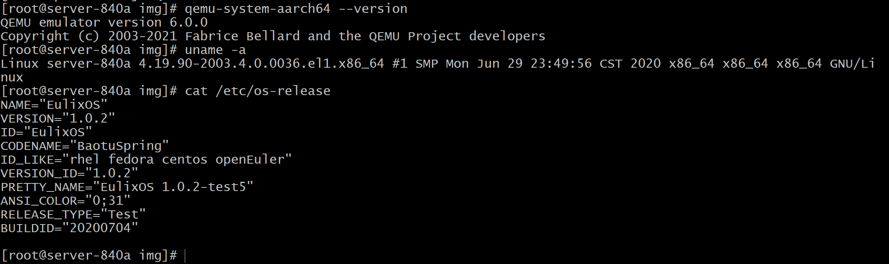
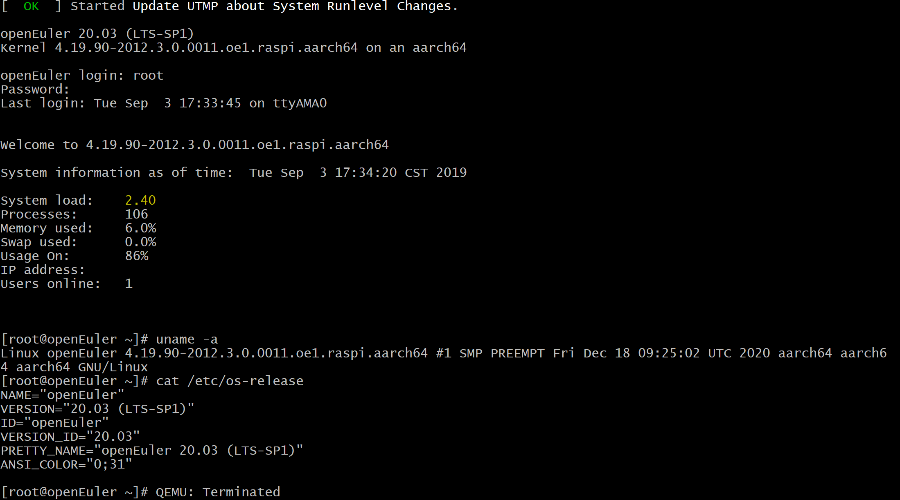

# 介绍

本文档主要介绍如何使用 [QEMU](https://www.qemu.org/) 模拟启动 openEuler 的树莓派镜像。

# 实验环境

- 操作系统：EulixOS
- 架构：x86_64

实验环境相关信息见下图：




# 安装 QEMU

1.  下载 QEMU

    从 [QEMU](https://download.qemu.org/) 下载源码。我们这里下载当前最新版本 [QEMU 6.0.0](https://download.qemu.org/qemu-6.0.0.tar.xz)。执行命令：

    `wget https://download.qemu.org/qemu-6.0.0.tar.xz`

2.  解压缩源码

    `tar xvJf qemu-6.0.0.tar.xz`

3.  配置 QEMU

    `./configure --target-list=arm-softmmu,aarch64-softmmu --enable-debug --enable-sdl`

    可以通过命令 `./configure --help` 查看配置相关选项和帮助信息。

    如配置失败，需根据提示解决问题。例如，可能需要安装依赖包 `SDL2-devel` 和 `meson`：`dnf -y install SDL2-devel meson`。

4.  编译 QEMU

    `make`

5.  安装 QEMU

    `make install`

6.  查看 QEMU 版本

    例如，通过命令 `qemu-system-aarch64 --version` 查看 qemu-system-aarch64 工具的版本。

# 准备 openEuler 镜像等文件

1.  下载 openEuler 的树莓派镜像

    openEuler 的树莓派镜像下载链接详见 [RaspberryPi SIG 主仓库](https://gitee.com/openeuler/raspberrypi)。这里我们以 openEuler 社区发布的 openEuler 20.03 LTS SP1 版本的树莓派镜像为例，执行命令：

    `wget https://repo.openeuler.org/openEuler-20.03-LTS-SP1/raspi_img/aarch64/openEuler-20.03-LTS-SP1-raspi-aarch64.img.xz`

    镜像所在路径记为 IMG_DIR。

2.  解压缩镜像

    `xz -d openEuler-20.03-LTS-SP1-raspi-aarch64.img.xz`

    得到镜像文件 `openEuler-20.03-LTS-SP1-raspi-aarch64.img`。

3.  提取 dtb 和 kernel8.img

    1.  使用 losetup 将镜像文件虚拟成块设备

        `losetup -f --show openEuler-20.03-LTS-SP1-raspi-aarch64.img`

        例如，显示结果为 /dev/loop0。

    2.  使用 kpartx 创建分区表 /dev/loop0 的设备映射

        `kpartx -va /dev/loop0`

        得到结果将 /dev/loop0 三个分区挂载了:
        ```
        add map loop0p1 ...
        add map loop0p2 ...
        add map loop0p3 ...
        ```

        执行 `ls /dev/mapper/loop0p*` 可以看到 openEuler-20.03-LTS-SP1-raspi-aarch64.img 的三个分区：

        ```
        /dev/mapper/loop0p1 /dev/mapper/loop0p2 /dev/mapper/loop0p3
        ```

    3.  挂载镜像的 boot 分区

        创建挂载路径，如 /home/xxx/boot，则需要执行命令 `mkdir /home/xxx/boot`。下面将该挂载路径记为 `BOOT_DIR`。
    
        挂载镜像的 boot 分区到 BOOT_DIR：`mount /dev/mapper/loop0p1 BOOT_DIR`。

    4.  提取 dtb 和 kernel8.img 到 IMG_DIR

        ```
        cd IMG_DIR
        cp BOOT_DIR/kernel8.img ./
        cp BOOT_DIR/*.dtb ./
        ```

# QEMU 模拟启动树莓派

1.  查看可供选择模拟的机器

    `qemu-system-aarch64  -M help`

    我们这里选择 `raspi3`。

2.  模拟启动树莓派

    ```
    cd IMG_DIR
    qemu-system-aarch64 -M raspi3 -cpu cortex-a53 -m 1024 -kernel kernel8.img -dtb bcm2710-rpi-3-b.dtb -sd openEuler-20.03-LTS-SP1-raspi-aarch64.img  -net user,hostfwd=tcp::6022-:22 -append "rw earlyprintk loglevl=8 console=ttyAMA0,115200 dwc_otg.lpm_enable=0 root=/dev/mmcblk0p3 rootwait  panic=1" -no-reboot -nographic
    ```

    QEMU 相关命令及其参数可参考 [QEMU Quick Start](https://qemu-project.gitlab.io/qemu/system/quickstart.html)。

    启动后根据提示输入用户名密码即可登录。如下图，登录成功后，输出显示当前系统相关信息。`ctl + a` 抬起后再输入 `x`，即可退出 QEMU 模拟器环境。

    
