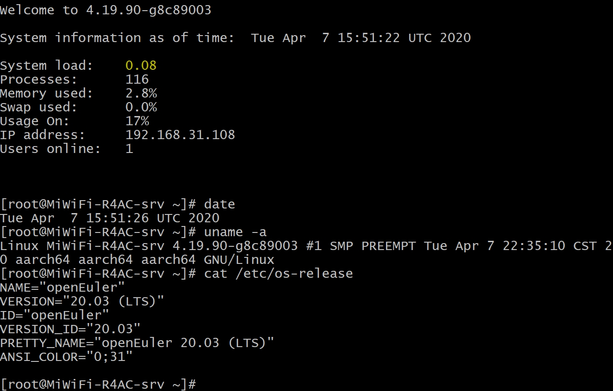

<!-- TOC -->

- [介绍](#介绍)
- [实验环境](#实验环境)
- [安装依赖软件](#安装依赖软件)
- [编译](#编译)
    - [下载内核源码](#下载内核源码)
    - [进入内核源码](#进入内核源码)
    - [切换分支](#切换分支)
    - [设置环境变量](#设置环境变量)
    - [载入默认配置](#载入默认配置)
    - [编译内核](#编译内核)
    - [创建编译内核模块目录](#创建编译内核模块目录)
    - [编译内核模块](#编译内核模块)
    - [收集编译结果](#收集编译结果)
- [验证内核可用性](#验证内核可用性)
    - [将内核模块放进rootfs](#将内核模块放进rootfs)
    - [将内核放进引导](#将内核放进引导)
    - [将设备树文件放进引导](#将设备树文件放进引导)

<!-- /TOC -->

# 介绍

> **说明：**   
>如需根据自身需求定制内核，可参考本文档。

目前 openEuler 树莓派版本只支持 AArch64 架构。

编译内核时，除了使用 AArch64 架构的运行环境，也可以采用交叉编译的方式。这里，我们以 ubuntu16.04 x86_64 的服务器上编译内核为例，介绍交叉编译的过程。

# 实验环境

- 操作系统：ubuntu16.04
- 架构：x86_64

# 安装依赖软件

`apt-get install build-essential gcc-aarch64-linux-gnu binutils-aarch64-linux-gnu bc libssl-dev -y`

# 编译

操作目录：${WORKDIR}

## 下载内核源码

根据内核不同版本，需要下载不同仓库的不同分支：

1.  5.10 内核

    - openEuler 22.03 LTS SP1：`git clone git@gitee.com:openeuler/raspberrypi-kernel.git -b openEuler-22.03-LTS-SP1 && cd raspberrypi-kernel`
    - openEuler 22.09：`git clone git@gitee.com:openeuler/raspberrypi-kernel.git -b openEuler-22.09 && cd raspberrypi-kernel`
    - openEuler 22.03 LTS：`git clone git@gitee.com:openeuler/raspberrypi-kernel.git -b openEuler-22.03-LTS && cd raspberrypi-kernel`
    - openEuler 21.09：`git clone git@gitee.com:openeuler/raspberrypi-kernel.git -b openEuler-21.09 && cd raspberrypi-kernel`
    - openEuler 21.03：`git clone git@gitee.com:openeuler/kernel.git -b openEuler-21.03 && cd kernel`

2.  4.19 内核

    - openEuler 20.03 LTS：`git clone git@gitee.com:openeuler/raspberrypi-kernel.git -b openEuler-20.03-LTS && cd raspberrypi-kernel`
    - openEuler 20.09：`git clone git@gitee.com:openeuler/raspberrypi-kernel.git -b openEuler-20.09 && cd raspberrypi-kernel`

## 设置环境变量

`export ARCH=arm64`

`export CROSS_COMPILE=aarch64-linux-gnu-`

## 载入默认配置

根据内核不同版本，需要载入不同的默认配置：

1.  5.10 内核

    - openEuler 22.03 LTS SP1：`make bcm2711_defconfig`
    - openEuler 22.09：`make bcm2711_defconfig`
    - openEuler 22.03 LTS：`make bcm2711_defconfig`
    - openEuler 21.09：`make bcm2711_defconfig`
    - openEuler 21.03：`make bcm2711_defconfig`

2.  4.19 内核

    - openEuler 20.03 LTS：`make openeuler-raspi_defconfig`
    - openEuler 20.09：`make openeuler-raspi_defconfig`

对应的 defconfig 文件在 ./arch/arm64/configs 下。

## 编译内核

`make -j9`

## 创建编译内核模块目录

`mkdir ${WORKDIR}/ouput`

## 编译内核模块

`make INSTALL_MOD_PATH=${WORKDIR}/output/ modules_install`

在 ${WORKDIR}/output 文件夹下会生成 lib 文件夹。

## 收集编译结果

1.  内核
    
    `cp ${WORKDIR}/raspberrypi-kernel/arch/arm64/boot/Image ${WORKDIR}/output/`

2.  设备树文件等

    `cp ${WORKDIR}/raspberrypi-kernel/arch/arm64/boot/dts/broadcom/*.dtb ${WORKDIR}/output/`

    `mkdir ${WORKDIR}/output/overlays`

    `cp ${WORKDIR}/raspberrypi-kernel/arch/arm64/boot/dts/overlays/*.dtb* ${WORKDIR}/output/overlays/`

至此，所有内核及内核模块相关内容都在 ${WORKDIR}/output 下了。

# 验证内核可用性

使用一个之前刷好 openEuler 树莓派镜像的 SD 卡，直接插到 Linux 主机上，SD 会默认挂载其 boot 分区和 根目录分区。这里其挂载路径分别表示为 ${boot} 和 ${rootfs}，将上面编译好的内核放置到SD卡对应分区。

## 将内核模块放进rootfs

`cp -r ${WORKDIR}/output/lib/modules ${rootfs}/lib/`

## 将内核放进引导

`cp ${WORKDIR}/output/Image ${boot}/kernel8.img`

## 将设备树文件放进引导

`cp ${WORKDIR}/output/*.dtb ${boot}/`

`cp ${WORKDIR}/output/overlays/* ${boot}/overlays/`

之后，参考 [树莓派使用](./树莓派使用.md) 使用该 SD 卡启用树莓派，验证功能：

