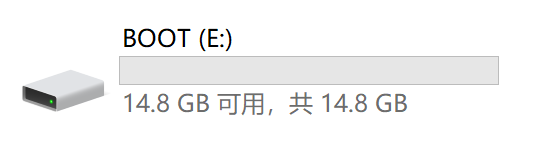
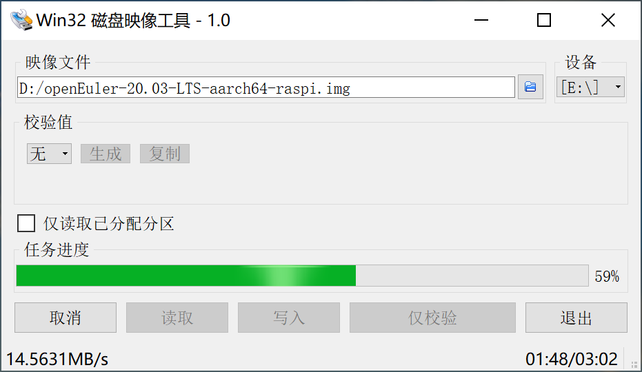

<!-- TOC -->

- [实验环境](#实验环境)
- [获取树莓派 img 镜像](#获取树莓派-img-镜像)
- [刷写 SD 卡](#刷写-sd-卡)
    - [Windows 环境](#windows-环境)
        - [格式化 SD 卡](#格式化-sd-卡)
        - [写入 SD 卡](#写入-sd-卡)
    - [Linux 环境](#linux-环境)
        - [查看磁盘分区信息](#查看磁盘分区信息)
        - [卸载 SD 卡挂载点](#卸载-sd-卡挂载点)
        - [写入 SD 卡](#写入-sd-卡-1)
    - [Mac 环境](#mac-环境)
        - [查看磁盘分区信息](#查看磁盘分区信息-1)
        - [卸载 SD 卡挂载点](#卸载-sd-卡挂载点-1)
        - [写入 SD 卡](#写入-sd-卡-2)
- [树莓派使用](#树莓派使用)

<!-- /TOC -->

# 实验环境

- Windows10/Linux/Mac
- 树莓派 3B/3B+/4B/400
- 8G 及以上的 Micro SD 卡

# 获取树莓派 img 镜像

下载适配树莓派的最新 openEuler 镜像，下面以获取 `openEuler-20.03-LTS-aarch64-raspi.img.xz` 镜像为例。

# 刷写 SD 卡

下面分别介绍 Windows、Linux、Mac 下的刷机步骤。

## Windows 环境

### 格式化 SD 卡

请按照以下步骤格式化 SD 卡：

1.  下载并安装格式化 SD 卡工具，以下操作以 SD Card Formatter 格式化工具为例。
2.  打开 SD Card Formatter，在 `Select card` 中选择需要格式化的 SD 卡的盘符。

    若 SD 卡之前未安装过镜像，盘符只有一个。在 `Select card` 中选择需要格式化的 SD 卡对应盘符。

    若 SD 卡之前安装过镜像，盘符会有一个或多个。如下图所示，该 SD 卡对应三个盘符：E、G、H。在 `Select card` 中选择需要格式化的 SD 卡对应 boot 分区盘符 E。

    

3.  在 `Formatting options` 中选择格式化方式。默认为 `Quick format`。
4.  单击 `Format` 开始格式化。界面通过进度条显示格式化进度。
5.  格式化完成后会弹出 `Formatting was successfully completed` 的提示框，单击 `确定` 完成格式化。
    
    如下图所示，格式化后 SD 卡的盘符只有一个。
    
    

### 写入 SD 卡

> **须知：**   
>如果获取的是压缩后的镜像文件 `openEuler-20.03-LTS-aarch64-raspi.img.xz`，需要先将压缩文件解压得到 `openEuler-20.03-LTS-aarch64-raspi.img` 镜像文件。

请按照以下步骤将 img 格式的镜像文件写入 SD 卡：

1.  下载并安装刷写镜像的工具，以下操作以 Win32 Disk Imager 工具为例。
2.  右键选择“以管理员身份运行”，打开 Win32 Disk Imager。
3.  在“映像文件”中选择 img 格式的镜像文件路径。
4.  在“设备”中选择待写入的 SD 卡盘符。
5.  单击“写入”。如下图所示，界面通过任务进度条显示写入 SD 卡的进度。
   
    

6.  写入完成后会弹出 “写入成功” 的提示框，单击“OK”完成写入。
    
    如下图所示，写入成功后，SD 卡自动分区后的盘符为三个。
    
    

## Linux 环境

### 查看磁盘分区信息

执行 `fdisk -l` 获取 SD 卡磁盘信息，例如 SD 卡对应磁盘为 /dev/sdb。

### 卸载 SD 卡挂载点

1.  执行 `df -lh` 命令查看当前已挂载的卷。
2.  如果 SD 卡对应的分区未挂载，则跳过该步骤；如果 SD 卡对应分区已挂载，如 SD 卡对应的两个分区 /dev/sdb1 和 /dev/sdb3 已挂载，则需要卸载对应分区，执行以下命令：

    `umount /dev/sdb1`

    `umount /dev/sdb3`

### 写入 SD 卡

1.  如果获取的是压缩后的镜像，需要先执行 `xz -d openEuler-20.03-LTS-aarch64-raspi.img.xz` 命令将压缩文件解压得到 `openEuler-20.03-LTS-aarch64-raspi.img` 镜像文件；否则，跳过该步骤。
2.  将镜像 `openEuler-20.03-LTS-aarch64-raspi.img` 刷写入 SD 卡，执行以下命令：
    
    `dd bs=4M if=openEuler-20.03-LTS-aarch64-raspi.img of=/dev/sdb`

    > **说明：** 
    >一般情况下，将块大小设置为 4M。如果写入失败或者写入的镜像无法使用，可以尝试将块大小设置为 1M 重新写入，但是设置为 1M 比较耗时。

## Mac 环境

### 查看磁盘分区信息

执行 `diskutil list` 获取 SD 卡磁盘信息，例如 SD 卡对应磁盘为 /dev/disk3。

### 卸载 SD 卡挂载点

1.  执行 `df -lh` 命令查看当前已挂载的卷。
2.  如果 SD 卡对应的分区未挂载，则跳过该步骤；如果 SD 卡对应分区已挂载，如 SD 卡对应的两个分区 /dev/disk3s1 和 /dev/disk3s3 已挂载，则需要卸载对应分区，执行以下命令：

    `diskutil umount /dev/disk3s1`

    `diskutil umount /dev/disk3s3`

### 写入 SD 卡

1.  如果获取的是压缩后的镜像，需要先执行 `xz -d openEuler-20.03-LTS-aarch64-raspi.img.xz` 命令将压缩文件解压得到 `openEuler-20.03-LTS-aarch64-raspi.img` 镜像文件；否则，跳过该步骤。
2.  将镜像 `openEuler-20.03-LTS-aarch64-raspi.img` 刷入 SD 卡，执行以下命令：

    `dd bs=4m if=openEuler-20.03-LTS-aarch64-raspi.img of=/dev/sdb`

    > **说明：** 
    >一般情况下，将块大小设置为 4m。如果写入失败或者写入的镜像无法使用，可以尝试将块大小设置为 1m 重新写入，但是设置为 1m 比较耗时。

# 树莓派使用

SD 卡刷好镜像之后，就可以使用树莓派了，详见 [树莓派使用](./树莓派使用.md)。