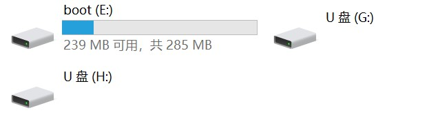
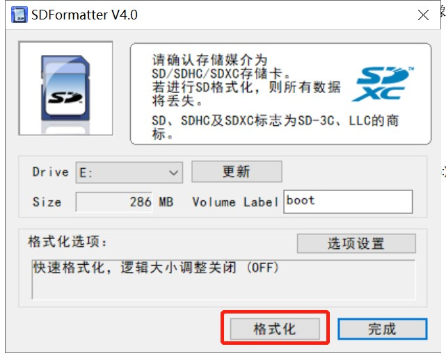
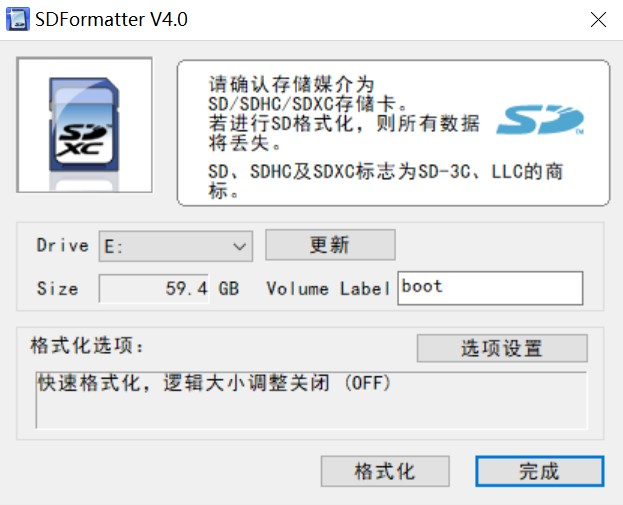
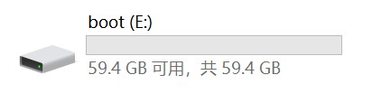
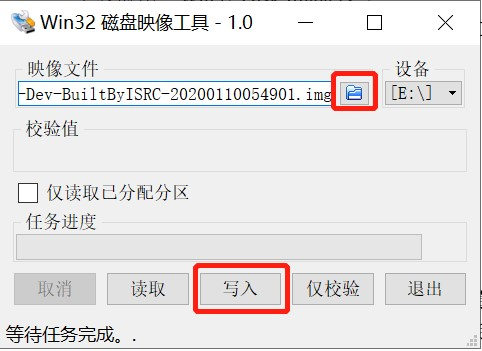

[toc]

# 实验环境

- Windows10/Linux/Mac
- 树莓派 3B/3B+/4B
- 16G 以上的 Micro SD 卡

# 获取树莓派 img 镜像

下载适配树莓派的最新 openEuler 镜像，下面以 `XXX.img` 表示该镜像。

# 刷机操作

下面分别介绍 Windows、Linux、Mac 下的刷机步骤。

## Windows 环境

### 格式化 SD 卡

下载应用：SDFormater，用于格式化 SD 卡。

若 SD 卡之前未安装过镜像，盘符正常只有一个，选择 SD 卡对应盘符，直接格式化即可；

若 SD 卡之前安装过镜像，盘符会有三个，选择 SD 卡对应盘符（图例中为 E: 盘），格式化即可：

### 写入 SD 卡

下载应用：Win32 Disk Imager。

右键选择“以管理员身份运行”，打开 Win32 Disk Imager，选择镜像 img 文件和待写入的 SD 卡，点击【写入/Write】。

写入完成即可。

写入成功后，SD 卡自动分区后的盘符为：

## Linux 环境

### 查看磁盘分区信息

`fdisk -l`

获取 SD 卡磁盘信息，例如 SD 卡对应磁盘为 /dev/sdb。

### 卸载 SD 卡挂载点

查看当前已挂在的卷

`df -lh`

例如，SD 卡对应磁盘两个分区 /dev/sdb1 和 /dev/sdb3 默认已挂载。
卸载对应分区：

`umount /dev/sdb1`

`umount /dev/sdb3`

### 写入 SD 卡

将下载的镜像 `XXX.img` 刷入 SD 卡。

`dd bs=4M if=XXX.img of=/dev/sdb`

## Mac 环境

### 查看磁盘分区信息

`diskutil list`

获取 SD 卡磁盘信息，例如 SD 卡对应磁盘为 /dev/disk3。

### 卸载 SD 卡挂载点

查看当前已挂在的卷

`df -lh`

例如，SD 卡对应磁盘两个分区 /dev/disk3s1 和 /dev/disk3s3 默认已挂载。
卸载对应分区：

`diskutil umount /dev/sdb1`

`diskutil umount /dev/sdb3`

### 写入 SD 卡

将下载的镜像 `XXX.img` 刷入 SD 卡。

`dd bs=4m if=XXX.img of=/dev/sdb`

# 树莓派使用

SD 卡刷好镜像之后，就可以使用树莓派了，详见 [树莓派使用](./树莓派使用.md)。