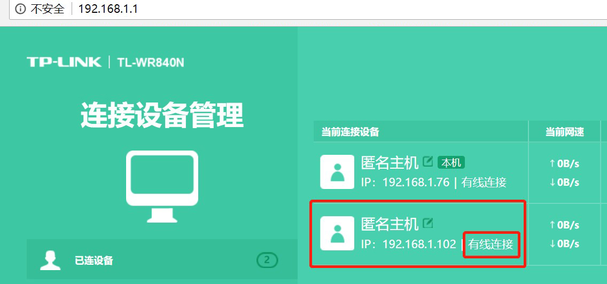
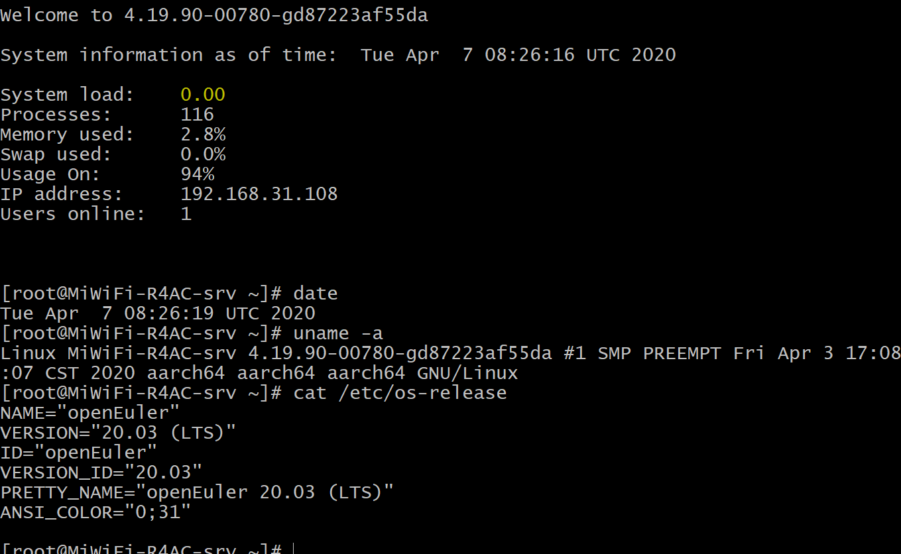
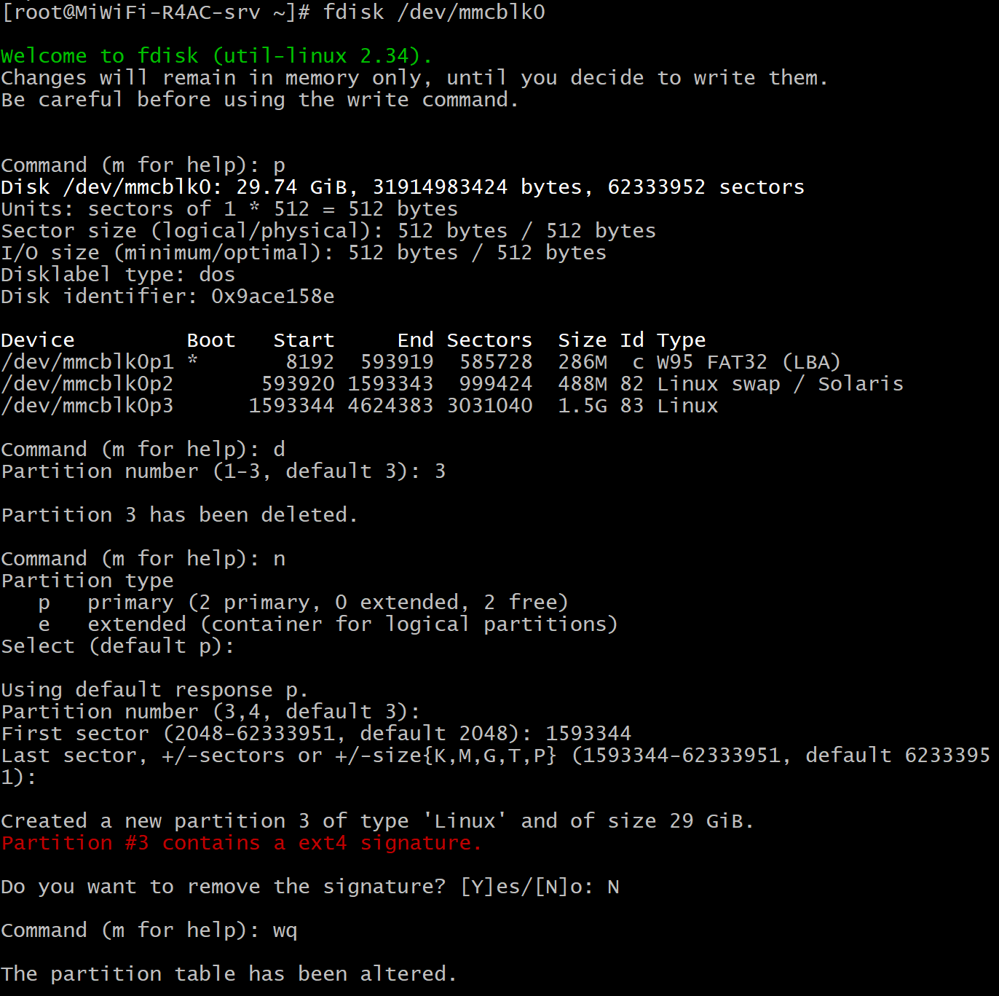

# 启用树莓派

版本要求：树莓派 3B/3B+/4B。

默认用户名：root，密码：openeuler。

将刷好的 SD 卡插入树莓派，通电启用。树莓派正常启动，还需连接网线至局域网。

由于使用树莓派时，大多都使用 ssh 远程连接；在树莓派启动联网时，无法得知其 IP 地址。

有以下两种方式：

1. 如果树莓派连接已知路由器，可登陆路由器管理，新增的IP即为树莓派IP：

2. 将树莓派连接显示器，需注意，树莓派视频输出接口为 Micro HDMI

连接显示器后，直接用户名/密码登陆，登陆成功后，树莓派即显示本机相关信息，包括本机 IP。如下图（ssh登陆也显示这些信息）：

# 根目录分区扩展

默认根目录分区空间比较小，在使用之前，需要对分区进行扩容。

## 查看磁盘分区信息

`fdisk -l`

获取 SD 卡磁盘信息，例如 SD 卡对应磁盘为 /dev/mmcblk0。openEuler 镜像包括3个分区，分别为

- 引导分区 /dev/mmcblk0p1
- 交换分区 /dev/mmcblk0p2
- 根目录分区 /dev/mmcblk0p3

这里我们需要将根目录分区进行扩容。

## 分区扩容

### 操作磁盘 /dev/mmcblk0

`fdisk /dev/mmcblk0`

### 查看当前分区情况

`p`

记录下分区 /dev/mmcblk0p3 的起始扇区号，这里记为 `xxx`。

### 删除分区 /dev/mmcblk0p3

`d`

### 选择要删除的分区序号

回车（默认为3）或 输入`3`

### 创建新的分区

`n`

### 选择创建分区类型

回车（默认为 p）或 输入`p`

### 选择要创建的分区序号

回车（默认为3）或 输入`3`

### 输入新分区的起始扇区号

`xxx`

这是输入删除分区 /dev/mmcblk0p3 之前查看到的的起始扇区号。

### 输入新分区的终止扇区号

回车

取默认的最后一个扇区号。

### 是否修改扇区标记

`N`

不修改。

### 保存并退出

`wq`

该操作结束后，使用 `fdisk -l` 命令可以看到 /dev/mmcblk0p3大小已经扩展。但是通过 `df -lh`可以看到根目录大小没有变化。

### 增大未加载的文件系统大小

`resize2fs /dev/mmcblk0p3`

如果该命令失败，可通过命令 `reboot`重启树莓派之后再执行`resize2fs /dev/mmcblk0p3`。

该操作结束后，通过 `df -lh`可以看到根目录大小已经扩展。

至此，根目录分区扩容结束。扩容过程见下图：

