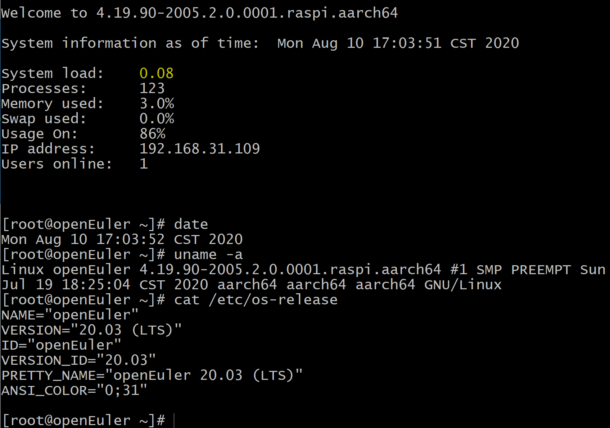
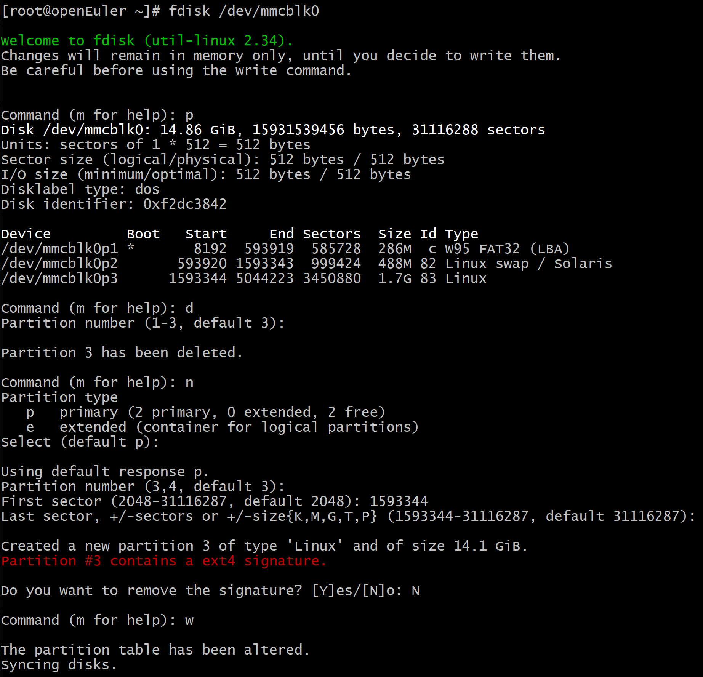
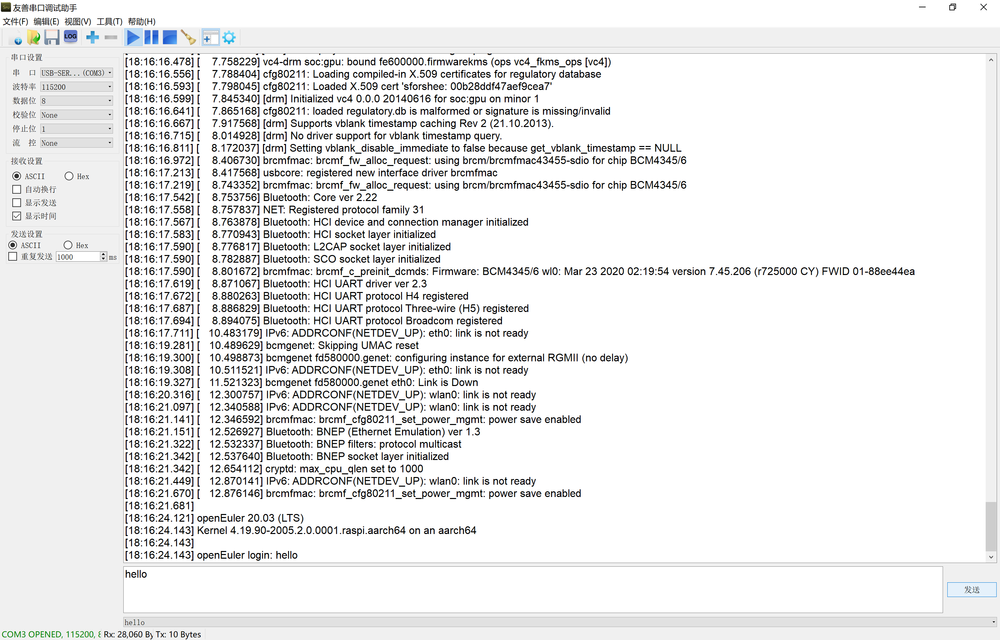
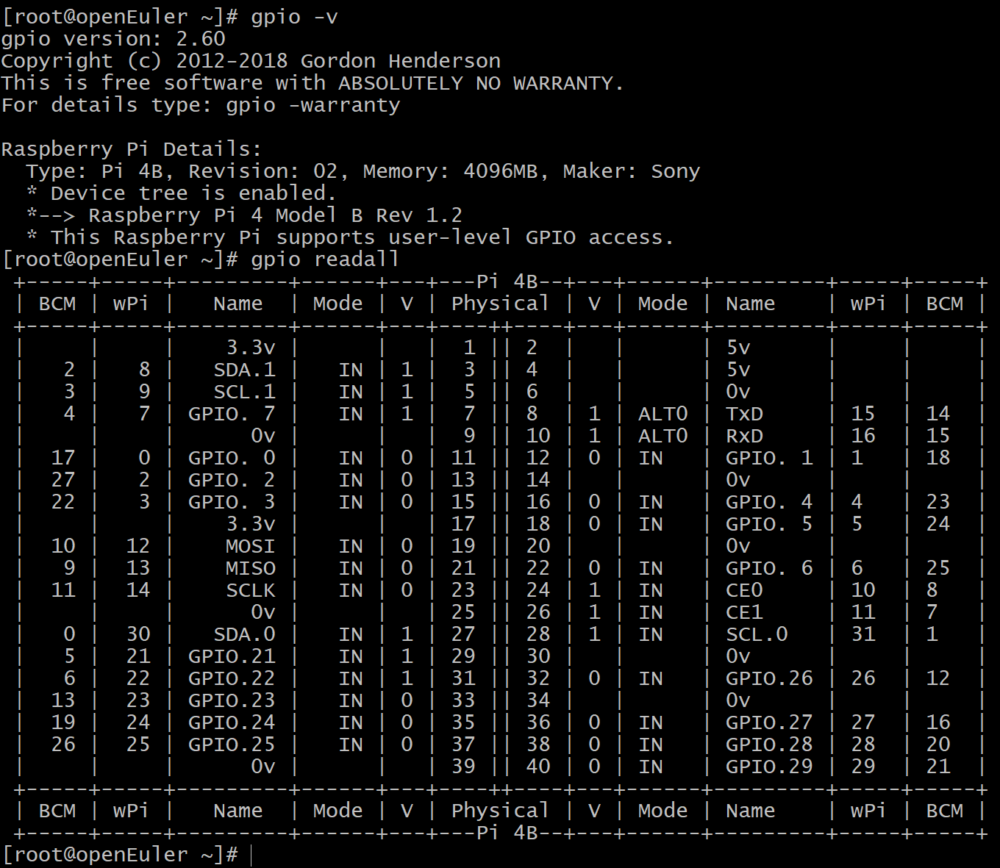

<!-- TOC -->

- [启用树莓派](#启用树莓派)
- [根目录分区扩展](#根目录分区扩展)
    - [查看磁盘分区信息](#查看磁盘分区信息)
    - [分区扩容](#分区扩容)
    - [查看扩容后磁盘分区信息](#查看扩容后磁盘分区信息)
    - [增大未加载的文件系统大小](#增大未加载的文件系统大小)
    - [查看磁盘空间信息](#查看磁盘空间信息)
- [wifi 连接](#wifi-连接)
    - [查看 IP 和网卡信息](#查看-ip-和网卡信息)
    - [连接 wifi](#连接-wifi)
    - [查看 IP 和无线网卡信息](#查看-ip-和无线网卡信息)
- [音频](#音频)
    - [开启音频](#开启音频)
    - [安装音频播放软件](#安装音频播放软件)
    - [播放音频](#播放音频)
    - [音频输出配置](#音频输出配置)
        - [HDMI](#hdmi)
        - [耳机插孔](#耳机插孔)
        - [自动（默认）](#自动默认)
- [蓝牙](#蓝牙)
    - [开启蓝牙](#开启蓝牙)
    - [查看蓝牙设备](#查看蓝牙设备)
    - [连接蓝牙](#连接蓝牙)
    - [播放音乐](#播放音乐)
    - [文件传输](#文件传输)
- [GPIO](#gpio)
    - [简介](#简介)
    - [UART](#uart)
        - [UART 连线](#uart-连线)
        - [串口通信](#串口通信)
            - [蓝牙使用 PL011 UART，禁用串口](#蓝牙使用-pl011-uart禁用串口)
            - [蓝牙使用 PL011 UART，串口使用 mini UART](#蓝牙使用-pl011-uart串口使用-mini-uart)
            - [禁用蓝牙，串口使用 PL011 UART](#禁用蓝牙串口使用-pl011-uart)
            - [蓝牙使用 mini UART，串口使用 PL011 UART](#蓝牙使用-mini-uart串口使用-pl011-uart)
    - [WiringPi](#wiringpi)
        - [下载 WiringPi](#下载-wiringpi)
        - [安装 WiringPi](#安装-wiringpi)
        - [使用 WiringPi](#使用-wiringpi)

<!-- /TOC -->

# 启用树莓派

版本要求：树莓派 3B/3B+/4B。

默认用户名：root，密码：openeuler。

将刷写镜像后的 SD 卡插入树莓派，通电启用。

登录树莓派有以下两种方式：

1.  本地登录

    树莓派连接显示器（树莓派视频输出接口为 Micro HDMI）、键盘、鼠标后，启动树莓派，可以看到树莓派启动日志输出到显示器上。待树莓派启动成功，输入用户名（root）和密码（openeuler）登录。目前，openEuler 系统无桌面环境，添加桌面支持相关进度可关注 [期望增加桌面支持](https://gitee.com/openeuler/raspberrypi/issues/I1F21F)，欢迎大家参与。

2.  ssh 远程登录

    树莓派默认采用 DHCP 的方式自动获取 IP。如果树莓派连接已知路由器，可登录路由器查看，新增的 IP 即为树莓派 IP。

    

    从上图看到，树莓派对应 IP 为：192.168.31.109，使用命令 `ssh root@192.168.1.109` 后输入密码 `openeuler`，即可远程登录树莓派。

    如下图，登录成功后，树莓派即显示本机相关信息，包括本机 IP。

    

# 根目录分区扩展

默认根目录分区空间比较小，在使用之前，需要对分区进行扩容。

## 查看磁盘分区信息

执行 `fdisk -l` 命令查看磁盘分区信息。命令和回显如下：

```
# fdisk -l
Disk /dev/mmcblk0: 14.86 GiB, 15931539456 bytes, 31116288 sectors
Units: sectors of 1 * 512 = 512 bytes
Sector size (logical/physical): 512 bytes / 512 bytes
I/O size (minimum/optimal): 512 bytes / 512 bytes
Disklabel type: dos
Disk identifier: 0xf2dc3842

Device         Boot   Start     End Sectors  Size Id Type
/dev/mmcblk0p1 *       8192  593919  585728  286M  c W95 FAT32 (LBA)
/dev/mmcblk0p2       593920 1593343  999424  488M 82 Linux swap / Solaris
/dev/mmcblk0p3      1593344 5044223 3450880  1.7G 83 Linux
```

SD 卡对应盘符为 /dev/mmcblk0，包括 3 个分区，分别为

- /dev/mmcblk0p1：引导分区
- /dev/mmcblk0p2：交换分区
- /dev/mmcblk0p3：根目录分区

这里我们需要将根目录分区 `/dev/mmcblk0p3` 进行扩容。

## 分区扩容

执行 `fdisk /dev/mmcblk0` 命令进入到交互式命令行界面，按照以下步骤扩展分区，如下图所示。

1.  输入 `p`，查看分区信息。
    
    记录分区 `/dev/mmcblk0p3` 的起始扇区号，即 `/dev/mmcblk0p3` 分区信息中 `Start` 列的值，示例中为 `1593344`。

2.  输入 `d`，删除分区。
3.  输入 `3` 或直接按 `Enter`，删除序号为 `3` 的分区，即 `/dev/mmcblk0p3` 分区。
4.  输入 `n`，创建新的分区。
5.  输入 `p` 或直接按 `Enter`，创建 `Primary` 类型的分区。
6.  输入 `3` 或直接按 `Enter`，创建序号为 `3` 的分区，即 `/dev/mmcblk0p3` 分区。
7.  输入新分区的起始扇区号，即第 `1` 步中记录的起始扇区号，示例中为 `1593344`。

    > **须知：**   
    >请勿直接按“Enter”或使用默认参数。

8.  按 `Enter`，使用默认的最后一个扇区号作为新分区的终止扇区号。
9.  输入 `N`，不修改扇区标记。
10. 输入 `w`，保存分区设置并退出交互式命令行界面。

    

## 查看扩容后磁盘分区信息

执行 `fdisk -l` 命令查看磁盘分区信息，以确保磁盘分区正确。命令和回显如下：
    
```
# fdisk -l
Disk /dev/mmcblk0: 14.86 GiB, 15931539456 bytes, 31116288 sectors
Units: sectors of 1 * 512 = 512 bytes
Sector size (logical/physical): 512 bytes / 512 bytes
I/O size (minimum/optimal): 512 bytes / 512 bytes
Disklabel type: dos
Disk identifier: 0xf2dc3842

Device         Boot   Start      End  Sectors  Size Id Type
/dev/mmcblk0p1 *       8192   593919   585728  286M  c W95 FAT32 (LBA)
/dev/mmcblk0p2       593920  1593343   999424  488M 82 Linux swap / Solaris
/dev/mmcblk0p3      1593344 31116287 29522944 14.1G 83 Linux
```

## 增大未加载的文件系统大小

`resize2fs /dev/mmcblk0p3`

## 查看磁盘空间信息

执行 `df -lh` 命令查看磁盘空间信息，以确保根目录分区已扩展。
    
> **须知：**   
>如果根目录分区未扩展，可执行 `reboot` 命令重启树莓派之后再执行 `resize2fs /dev/mmcblk0p3`。

# wifi 连接

## 查看 IP 和网卡信息

`ip a`

获取无线网卡 wlan0 信息：

```
1: lo: <LOOPBACK,UP,LOWER_UP> mtu 65536 qdisc noqueue state UNKNOWN group default qlen 1000
    link/loopback 00:00:00:00:00:00 brd 00:00:00:00:00:00
    inet 127.0.0.1/8 scope host lo
       valid_lft forever preferred_lft forever
    inet6 ::1/128 scope host
       valid_lft forever preferred_lft forever
2: eth0: <BROADCAST,MULTICAST,UP,LOWER_UP> mtu 1500 qdisc mq state UP group default qlen 1000
    link/ether dc:a6:32:50:de:57 brd ff:ff:ff:ff:ff:ff
    inet 192.168.31.109/24 brd 192.168.31.255 scope global dynamic noprefixroute eth0
       valid_lft 41570sec preferred_lft 41570sec
    inet6 fe80::cd39:a969:e647:3043/64 scope link noprefixroute
       valid_lft forever preferred_lft forever
3: wlan0: <NO-CARRIER,BROADCAST,MULTICAST,UP> mtu 1500 qdisc fq_codel state DOWN group default qlen 1000
    link/ether e2:e6:99:89:47:0c brd ff:ff:ff:ff:ff:ff
```

## 连接 wifi

这里我们介绍连接 wifi 的两种方式：nmcli 命令行和 nmtui 字符界面。

1.  nmcli 命令行

    1.  扫描可以连接的 wifi 信息

        `nmcli dev wifi`

    2. 连接 wifi

        `nmcli dev wifi connect SSID password PWD`

        其中，`SSID` 为上一步扫描到的可供连接的 wifi 的 SSID，`PWD` 为对应 wifi 的密码。例如，`SSID` 为 `openEuler-wifi`，密码为 `12345678`，则连接该 wifi 命令为：`nmcli dev wifi connect openEuler-wifi password 12345678`，连接成功提示：

        ```
        Device 'wlan0' successfully activated with '26becaab-4adc-4c8e-9bf0-1d63cf5fa3f1'.
        ```

        > **说明：**
        >如果使用 nmcli 命令连接失败，例如提示 `Error: Connection activation failed: (7) Secrets were required, but not provided.` 等错误，可尝试使用 nmtui 字符界面连接 wifi。

2.  nmtui 字符界面

    执行 `nmtui` 命令进入到 nmtui 字符界面，按照以下步骤连接 wifi。

    1.  选择 `Edit a connection`，按 `Enter` 进入编辑网络连接窗口。
    2.  按下键盘右方向键选择 `Add`，按 `Enter` 进入新建网络连接窗口。
    3.  连接类型选择 `Wi-Fi` ，然后按下键盘右方向键选择 `Create`，按 `Enter` 进入 wifi 编辑连接信息的界面。
    4.  wifi 连接信息界面主要需要编辑以下内容，其他信息根据实际情况而定。编辑结束后选择 `OK`，按 `Enter` 完成编辑并回退到编辑网络连接窗口。
        1.  `Profile name` 栏输入该 wifi 连接的名称，这里可以使用默认名称，如 `Wi-Fi connection 1`；
        2.  `Device` 栏输入要使用的无线网卡接口，这里输入 `wlan0`；
        3.  `SSID` 栏输入要连接的 wifi 的 SSID；
        4.  `Security` 栏选择 wifi 密码加密方式，这里根据实际情况选择，例如选择 `WPA & WPA2 Personal`；
        5.  `Password` 栏输入 wifi 密码。

    5.  选择 `Back` 回退到最初的 nmtui 字符界面。
    6.  选择 `Activate a connection`，按 `Enter` 进入激活网络连接窗口。
    7.  查看添加的 wifi 连接是否已激活（已激活的连接名称前有 `*` 标记）。如果未激活，选择该 wifi 连接，然后按下键盘右方向键选择 `Activate`，按 `Enter` 激活该连接。待激活完成后，选择 `Back`，按 `Enter` 退出该激活界面，回退到最初的 nmtui 字符界面。
    8.  选择 `Quit`，然后按下键盘右方向键选择 `OK`，按 `Enter` 退出 nmtui 字符界面。

## 查看 IP 和无线网卡信息

`ip a`

```
1: lo: <LOOPBACK,UP,LOWER_UP> mtu 65536 qdisc noqueue state UNKNOWN group default qlen 1000
    link/loopback 00:00:00:00:00:00 brd 00:00:00:00:00:00
    inet 127.0.0.1/8 scope host lo
       valid_lft forever preferred_lft forever
    inet6 ::1/128 scope host
       valid_lft forever preferred_lft forever
2: eth0: <BROADCAST,MULTICAST,UP,LOWER_UP> mtu 1500 qdisc mq state UP group default qlen 1000
    link/ether dc:a6:32:50:de:57 brd ff:ff:ff:ff:ff:ff
    inet 192.168.31.109/24 brd 192.168.31.255 scope global dynamic noprefixroute eth0
       valid_lft 41386sec preferred_lft 41386sec
    inet6 fe80::cd39:a969:e647:3043/64 scope link noprefixroute
       valid_lft forever preferred_lft forever
3: wlan0: <BROADCAST,MULTICAST,UP,LOWER_UP> mtu 1500 qdisc fq_codel state UP group default qlen 1000
    link/ether dc:a6:32:50:de:58 brd ff:ff:ff:ff:ff:ff
    inet 192.168.31.110/24 brd 192.168.31.255 scope global dynamic noprefixroute wlan0
       valid_lft 43094sec preferred_lft 43094sec
    inet6 fe80::394:d086:27fa:deba/64 scope link noprefixroute
       valid_lft forever preferred_lft forever
```

# 音频

## 开启音频

编辑 /boot/config.txt：

`vim /boot/config.txt`

添加内容：

```
dtparam=audio=on
```

重启树莓派。

## 安装音频播放软件

这里以使用 mpg123 为例。

```
dnf install mpg123
```

## 播放音频

`mpg123 xxx.mp3`

## 音频输出配置

详细信息可参考[树莓派官方文档](https://www.raspberrypi.org/documentation/)，如：[audio-config](https://www.raspberrypi.org/documentation/configuration/audio-config.md)。

树莓派有两种音频输出模式：HDMI 和耳机插孔。可以根据需要更换输出模式。

如果您的 HDMI 显示器或电视具有内置扬声器，则可以通过 HDMI 电缆播放音频，但您可以将其切换到耳机或插入耳机插孔的其他扬声器。如果显示器有扬声器，则默认情况下声音通过 HDMI 输出；如果没有，则通过耳机插孔输出。这可能不是所需的输出设置，或者自动检测不准确，在这种情况下，您可以手动切换输出。

可以通过输入命令将音频输出切换到对应模式。

### HDMI

`amixer cset numid=3 2`

### 耳机插孔

`amixer cset numid=3 1`

### 自动（默认）

`amixer cset numid=3 0`

# 蓝牙

## 开启蓝牙

需要保证蓝牙已经开启，例如，如果树莓派启用了串口功能，`/boot/config.txt` 中会有配置项 `dtoverlay=pi3-disable-bt`，使用蓝牙则需要取消该配置项，请删除或注释。如果修改过`/boot/config.txt`的配置内容，需要重启树莓派。

## 查看蓝牙设备

`hciconfig`

例如，这里查看到的信息如下：

```
hci0:   Type: Primary  Bus: UART
        BD Address: AA:AA:AA:AA:AA:AA  ACL MTU: 1021:8  SCO MTU: 64:1
        UP RUNNING
        RX bytes:66475718 acl:151850 sco:0 events:1760 errors:0
        TX bytes:13827 acl:117 sco:0 commands:996 errors:0
```

## 连接蓝牙

执行 `bluetoothctl` 命令进入到交互式命令行界面，按照以下步骤连接蓝牙设备。

1.  输入 `power on` 开启控制器电源。
2.  输入 `agent on` 启用代理。
3.  输入 `default-agent` 设置默认代理连接。
4.  输入 `scan on` 搜索周边蓝牙设备。
    
    这里看到要连接的目标蓝牙设备对应的 MAC 地址，记为 `target-MAC`。

5.  输入 `pair target-MAC` 配对目标蓝牙设备。

    这里，可能会出现的问题：

    1.  Failed to pair: org.bluez.Error.AuthenticationCanceled

        解决：多次配对后仍然提示该错误，请重启 bluetooth 服务。

        ```
        systemctl restart bluetooth
        ```
        
6.  输入 `trust target-MAC` 信任目标蓝牙设备。
    
    这一步可忽略。

7.  输入 `connect target-MAC` 连接目标蓝牙设备。

    连接成功后，则会在该交互式命令行界面显示进入到目标蓝牙设备。

    这里，可能会出现的问题：

    1.  Attempting to connect to XX:XX:XX:XX:XX:XX
    Failed to connect: org.bluez.Error.Failed

        解决：重启 pluseaudio。

        ```
        pulseaudio -k
        pulseaudio --start
        ```
        如果重启多次仍然无效。在 `bluetoothctl` 交互命令中删除对应蓝牙设备信息：`remove target-MAC`，然后按照 `pair`、`trust`、`connect` 的过程连接蓝牙。

## 播放音乐

`target-MAC` 对应的设备上`设置->蓝牙`会显示已经连接到树莓派的蓝牙设备。该设备播放音乐，就可以通过树莓派收听。

> **须知：**   
>要保证树莓派已经开启音频。

## 文件传输

按照以下步骤通过蓝牙传输文件。

1.  下载软件 obexftp

    需要下载三个包：lib64obexftp、lib64openobex、obexftp，可在 [地址](https://rpmfind.net/linux/mageia/distrib/cauldron/aarch64/media/core/release/) 下载其最新版本。以我们下载时对应版本为例，执行以下命令：

    ```
    wget https://rpmfind.net/linux/mageia/distrib/cauldron/aarch64/media/core/release/lib64obexftp0-0.24-17.mga8.aarch64.rpm
    wget https://rpmfind.net/linux/mageia/distrib/cauldron/aarch64/media/core/release/lib64openobex1-1.7.2-3.mga8.aarch64.rpm
    wget https://rpmfind.net/linux/mageia/distrib/cauldron/aarch64/media/core/release/obexftp-0.24-17.mga8.aarch64.rpm
    ```

2.  安装 obexftp，执行以下命令：

    ```
    rpm -i lib64obexftp0-0.24-17.mga8.aarch64.rpm
    rpm -i lib64openobex1-1.7.2-3.mga8.aarch64.rpm
    rpm -i obexftp-0.24-17.mga8.aarch64.rpm
    ```

3.  查看文件传输的 channel，执行下面的命令：

    `sdptool browse target-MAC`

    查看结果：
    ```
    Browsing target-MAC ...
    ...
    Browsing target-MAC ...
    Service Search failed: Invalid argument
    Service Name: OBEX Phonebook Access Server
    Service RecHandle: 0x1000b
    Service Class ID List:
    "Phonebook Access - PSE" (0x112f)
    Protocol Descriptor List:
    "L2CAP" (0x0100)
    "RFCOMM" (0x0003)
        Channel: 19
    "OBEX" (0x0008)
    Profile Descriptor List:
    "Phonebook Access" (0x1130)
        Version: 0x0101

    Service Name: OBEX Object Push
    Service RecHandle: 0x1000c
    Service Class ID List:
    "OBEX Object Push" (0x1105)
    Protocol Descriptor List:
    "L2CAP" (0x0100)
    "RFCOMM" (0x0003)
        Channel: 12
    "OBEX" (0x0008)
    Profile Descriptor List:
    "OBEX Object Push" (0x1105)
        Version: 0x0102
    ...
    ```

    看到其中 `Service Name: OBEX Object Push` 下的 ` Channel: 12`。

4.  传输文件

    待传输的文件路径记为 `file-path`，执行以下命令：

    `obexftp -b target-MAC -B 12 -U NONE -p file-path`
    
    之后就可以在`target-MAC` 对应的设备上选择接收文件，进行文件传输。

# GPIO

## 简介

树莓派的一个强大特性是沿着板的上边缘有一排 GPIO（通用输入/输出）管脚。在所有当前的树莓派板上都可以找到一个 40 针 GPIO 引脚（在树莓派 Zero 和 Pi Zero W 上未填充）。在树莓派 1B+（2014年）之前，电路板包含较短的 26 针引脚。以树莓派 4B 为例，其 40 针脚见下图：


GPIO 是个比较重要的概念。用户可以通过 GPIO 口和硬件进行数据交互（如 UART），控制硬件工作（如 LED、蜂鸣器等），读取硬件的工作状态信号（如中断信号）等。GPIO 口的使用非常广泛。举例来说，40 个针脚中，有固定输出的 5V（2、4号PIN）、3.3V（1、17号PIN）和地线（Ground，6、9、14、20、25、30、34、39）。如果一个电路两端接在 5V 和地线之间，该电路就会获得 5V 的电压输入，相当于给树莓派通电，注意，此时就不可以再通过树莓派提供的电源同时通电。有一些针脚除了 GPIO 功能外，还提供了高级端口功能。例如，GPIO14 和 GPIO15 就可以充当 UART 端口。下面，我们以使用 UART（GPIO14 和 GPIO15）进行串口通信为例介绍如何使用树莓派 GPIO。

## UART

通用异步收发传输器（Universal Asynchronous Receiver/Transmitter)，通常称作 UART，是一种串行通信协议，其中数据是串行传输的，一次传输一个字节的数据，即逐位传输。作为把并行输入信号转成串行输出信号的芯片，UART 通常被集成于其他通讯接口的连结上。

树莓派有两个内置 UART。一个是硬件串口（PL011 UART，可以独立调整串口的速率和模式），在操作系统中对应文件 /dev/ttyAMA0；一个是迷你串口（mini UART），在操作系统中对应文件 /dev/ttyS0。在树莓派 2B/2B+ 等这些老版的树莓派上，PL011 UART 作为主 UART 用于 Linux 控制台，可用于外部的 UART 通信，因此可以独立调整串口的速率和模式；而在树莓派 Zero W、树莓派 3 及 3 以上版本，PL011 UART 作为辅助 UART 分配给了新增的板载蓝牙模块，mini UART 作为主 UART 用于 Linux 控制台进行串口通信。这里提到的主 UART 是分配给 Linux 控制台的 UART，在操作系统中对应文件 /dev/serial0（如果启用）；另一个 UART 则被称为辅助 UART，在操作系统中对应文件/dev/serial1（如果启用）。

mini UART 没有时钟源，必须由内核提供时钟参考源，它使用与 GPU 核心频率相关的频率。因此，随着 GPU 核心频率的变化，mini UART 的频率也会发生变化，从而改变 UART 的波特率。这使得 mini UART 不稳定，可能导致数据丢失或损坏。要使 mini UART 稳定，需要修复核心频率。此外，mini UART 没有奇偶校验支持。而 PL011 UART 是一款稳定的高性能 UART，比 mini UART 更高的吞吐量。因此，虽然 mini UART 也可以用于串口通信或者板载蓝牙，我们建议选择树莓派的 PL011 UART。

下面以树莓派 4B 为例，介绍不同配置下的串口通信以及板载蓝牙的使用情况。

### UART 连线

为了和树莓派串口通信，我们将树莓派的 UART 针脚连接到个人电脑（下面简称 PC）上。

UART 的端口至少有 RX、TX 和地线三个针脚。RX 负责读取，TX 负责输出。如果有两个 UART 端口，它们的连接方式如下：


 
在树莓派 4B 等设备中，TX 和 RX 就是 GPIO14 和 GPIO15 针脚。因此，我们把树莓派的针脚和外接设备（这里，我们使用 PC）按照上图的方式连接起来，就可以实现在树莓派和外接设备之间的串口通信。

一般的 PC 都没有暴露在外的 UART 针脚。为了通过 UART 来连接树莓派和 PC，需要一个 USB 和 UART 的转换器。这个转换器的一端是 USB 接口，插入 PC 的 USB 口；另一端是 UART 的针脚，可以按照 上图的方式连接到树莓派的 UART 针脚。连线示意图如下：


> **须知：**   
>如果你连接树莓派 UART 针脚所使用的杜邦线不止有三个接口，不要连接树莓派的 5V 或 3.3V 的针脚。如果一个电路两端接在 5V 和地线之间，该电路就会获得 5V 的电压输入，相当于给树莓派通电。此时，如果同时接通树莓派电源设备，会烧坏树莓派！

连接好之后，就可以实现树莓派和 PC 通信。Windows 中可以利用串口通信的图形化软件来和树莓派进行串口通信。注意，根据树莓派配置文件 boot/config.txt 中形如 `console=serial0,115200` 的配置项，串口通信的图形化软件中选择对应串口的波特率应设置为 115200。

### 串口通信

由于树莓派 4B 中，默认情况下，PL011 UART 分配给了新增的板载蓝牙模块，mini UART 用于 Linux 控制台进行串口通信。为了实现串口通信，我们可以使用 mini UART，也可以占用 PL011 UART。如果串口通信占用 PL011 UART，板载蓝牙就需要禁用或者使用 mini UART。

> **说明：**
>注意树莓派的配置文件 /boot/config.txt 中 `enable_uart` 这个配置项，`enable_uart` 的默认值取决于 UART 的实际角色。
>  - 如果将 ttyAMA0 分配给蓝牙模块（默认），则 `enable_uart` 默认为 0，即不启用 GPIO 串口；
>  - 如果将 mini UART 分配给蓝牙模块（`dtoverlay=pi3-miniuart-bt`），则 `enable_uart` 默认值为 1，即启用 GPIO 串口（使用 PL011 UART）；
>  - 如果禁用蓝牙（`dtoverlay=pi3-disable-bt`），则默认将 ttyAMA0 分配给串口通信模块（使用 PL011 UART）。

下面我们总结一下不同情况下的配置。

#### 蓝牙使用 PL011 UART，禁用串口

默认情况下，PL011 UART 作为辅助 UART 分配给了新增的板载蓝牙模块，在操作系统中对应文件 /dev/ttyAMA0（/dev/serial1）；mini UART 作为主 UART 分配给 Linux 控制台进行串口通信，该配置由 `enable_uart` 决定，默认为 0，表示不启用，即默认禁用串口通信。

命令 `ls -l /dev/serial*`，可以看到如下信息：

```
lrwxrwxrwx 1 root root 7 Sep  3  2019 /dev/serial1 -> ttyAMA0
```

#### 蓝牙使用 PL011 UART，串口使用 mini UART

PL011 UART 作为辅助 UART 分配给新增的板载蓝牙模块，在操作系统中对应文件 /dev/ttyAMA0（/dev/serial1）；mini UART 作为主 UART 分配给 Linux 控制台进行串口通信，在操作系统中对应文件 /dev/ttyS0（/dev/serial0）。

按照以下步骤进行设置：

1.  执行 `vim /boot/config.txt` 命令编辑配置文件。

    添加：

    ```
    enable_uart=1
    ```

    该配置项会同时将核心频率固定到 250MHz，无需设置 core_freq。

2.  执行命令 `systemctl enable hciuart` 设置 hciuart 服务开机启动（默认已设置）。如果已设置，则跳过该步骤。
3.  执行 `reboot` 命令重启树莓派。
4.  查看串口输出结果

    执行 `ls -l /dev/serial*` 命令，可以看到如下信息：

    ```
    lrwxrwxrwx 1 root root 5 Sep  3  2019 /dev/serial0 -> ttyS0
    lrwxrwxrwx 1 root root 7 Sep  3  2019 /dev/serial1 -> ttyAMA0
    ```

    在 PC 的串口通信图形化软件上，可以看到树莓派的开机日志以及树莓派上通过命令 `echo "hello" > /dev/serial0` 向串口输出的信息。见下图：

    

#### 禁用蓝牙，串口使用 PL011 UART

PL011 UART 作为主 UART 分配给 Linux 控制台用于串口通信，在操作系统中对应文件 /dev/ttyAMA0（/dev/serial0）。

按照以下步骤进行设置：

1.  执行 `vim /boot/config.txt` 命令编辑配置文件。

    添加：

    ```
    dtoverlay=pi3-disable-bt
    ```

2.  执行 `systemctl disable hciuart` 命令取消 hciuart 服务开机启动。否则，hciuart 服务会默认开机启动，且启动失败。
3.  执行 `reboot` 命令重启树莓派。
4.  查看串口输出结果

    执行 `ls -l /dev/serial*` 命令，可以看到如下信息：
    ```
    lrwxrwxrwx 1 root root 7 Sep  3  2019 /dev/serial0 -> ttyAMA0
    lrwxrwxrwx 1 root root 5 Sep  3  2019 /dev/serial1 -> ttyS0
    ```

    在 PC 的串口通信图形化软件上，可以看到树莓派的开机日志以及树莓派上通过命令 `echo "hello" > /dev/serial0` 向串口输出的信息。

#### 蓝牙使用 mini UART，串口使用 PL011 UART

PL011 UART 作为主 UART 分配给 Linux 控制台用于串口通信，在操作系统中对应文件 /dev/ttyAMA0（/dev/serial0）；mini UART 作为辅助 UART 分配给新增的板载蓝牙模块，在操作系统中对应文件 /dev/ttyS0（/dev/serial1）。

按照以下步骤进行设置：

1.  执行 `vim /boot/config.txt` 命令编辑配置文件。

    添加：

    ```
    core_freq=250
    dtoverlay=pi3-miniuart-bt
    ```

    > **须知：**   
    >这里需要设置 core_freq=250。

2.  执行命令 `systemctl enable hciuart` 设置 hciuart 服务开机启动（默认已设置）。如果已设置，则跳过该步骤。

3.  执行 `reboot` 命令重启树莓派。
4.  查看串口输出结果

    执行 `ls -l /dev/serial*` 命令，可以看到如下信息：
    ```
    lrwxrwxrwx 1 root root 7 Sep  3  2019 /dev/serial0 -> ttyAMA0
    lrwxrwxrwx 1 root root 5 Sep  3  2019 /dev/serial1 -> ttyS0
    ```

    在 PC 的串口通信图形化软件上，可以看到树莓派的开机日志以及树莓派上通过命令 `echo "hello" > /dev/serial0` 向串口输出的信息。

## WiringPi

WiringPi 是应用于树莓派平台的 GPIO 控制库函数，包括一套 GPIO 控制命令，可以控制树莓派GPIO管脚。WiringPi 是可以扩展的，用户可以利用 WiringPi 的内部模块或把自定义的扩展模块集成到 WiringPi 中以扩展更多的 GPIO 接口或支持更多的功能。

当前，[官方](http://wiringpi.com/download-and-install/) 提供的链接无法下载 WiringPi，这里使用 [WiringPi 下载链接](https://github.com/WiringPi/WiringPi)。

### 下载 WiringPi

`git clone https://github.com/WiringPi/WiringPi.git`

### 安装 WiringPi

`cd WiringPi`

`sudo ./build`

> **须知：**   
>当前系统默认未安装 sudo、make、gcc等，使用命令 `dnf install -y sudo make gcc` 安装。

### 使用 WiringPi

`gpio -v`

`gpio readall`



注意，使用命令 `gpio readall`，可能会报错：

```
wiringPiSetup: mmap (GPIO) failed: Operation not permitted
```

解决方法，编辑 `/boot/cmdline.txt` 添加内容 `iomem=relaxed`，执行 `reboot` 命令重启树莓派。

当前，`/boot/cmdline.txt` 最终内容为：

```
console=serial0,115200 console=tty1 root=/dev/mmcblk0p3 rootfstype=ext4 elevator=deadline iomem=relaxed rootwait
```
